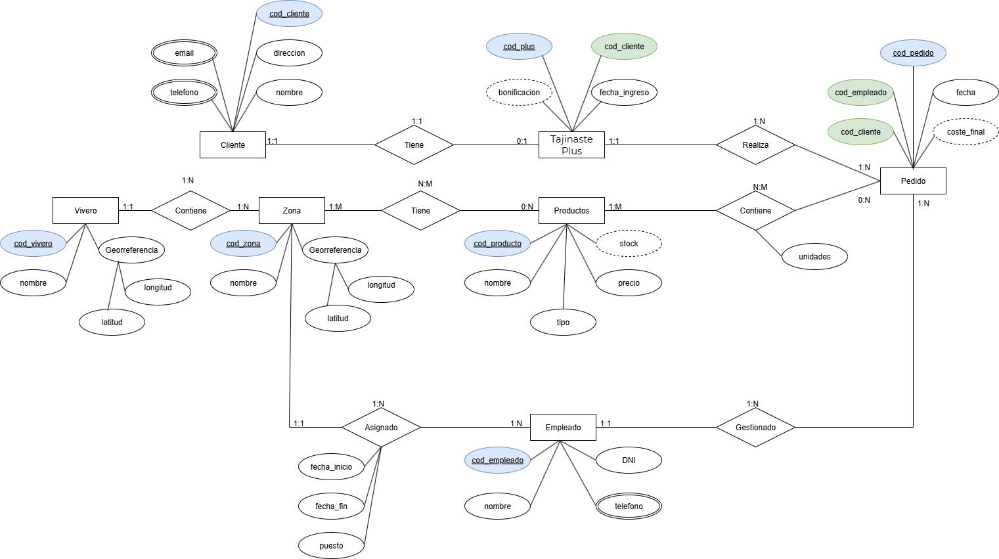
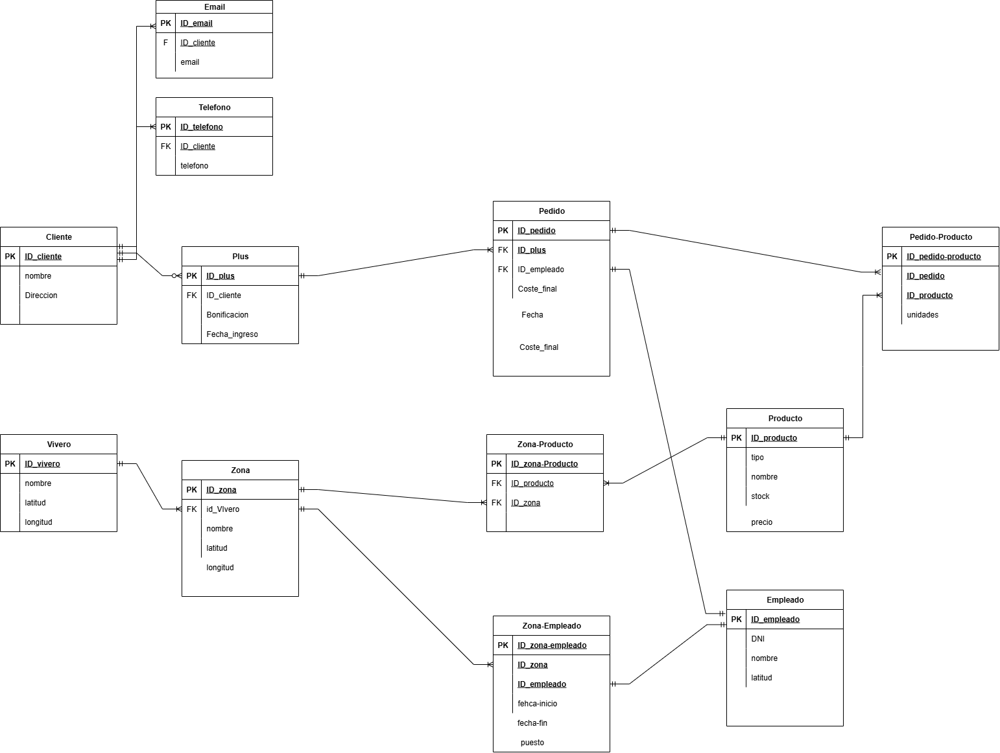
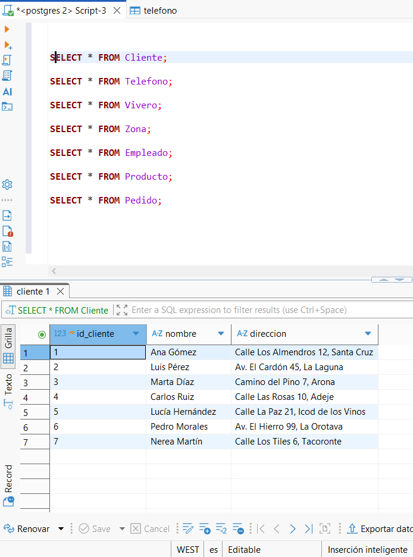
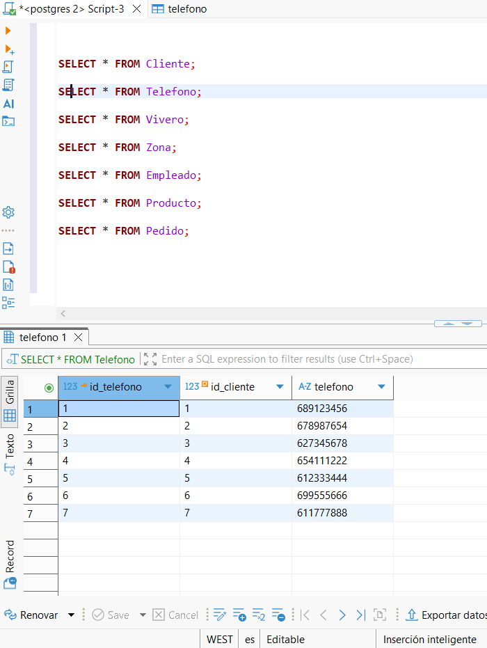
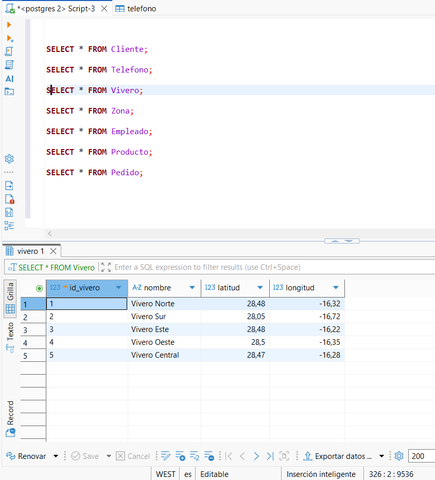
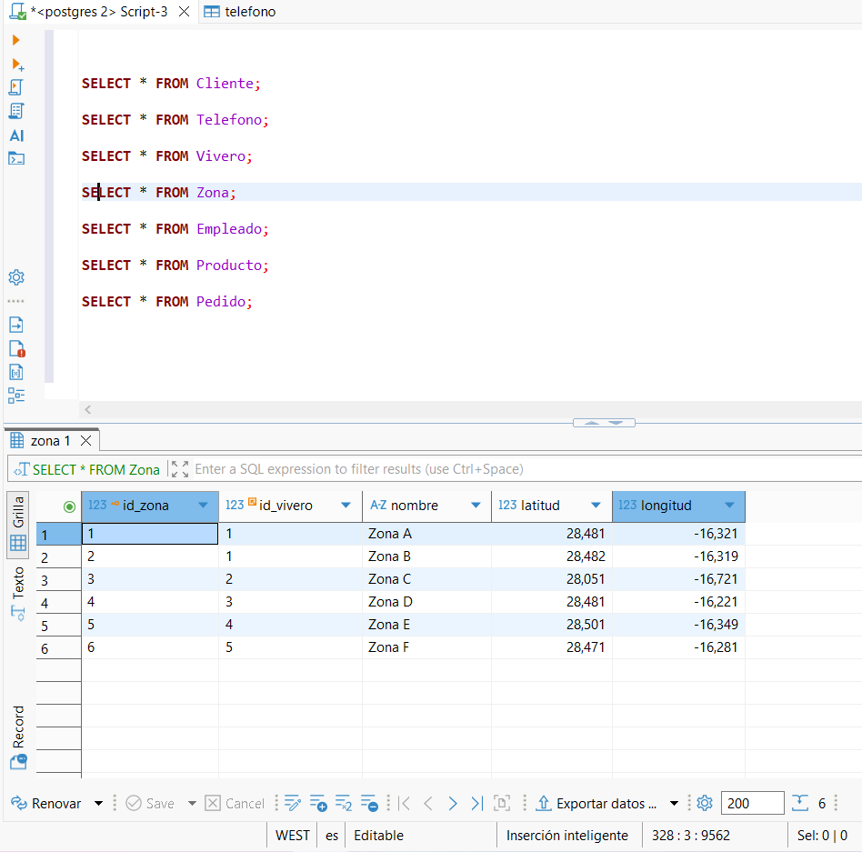
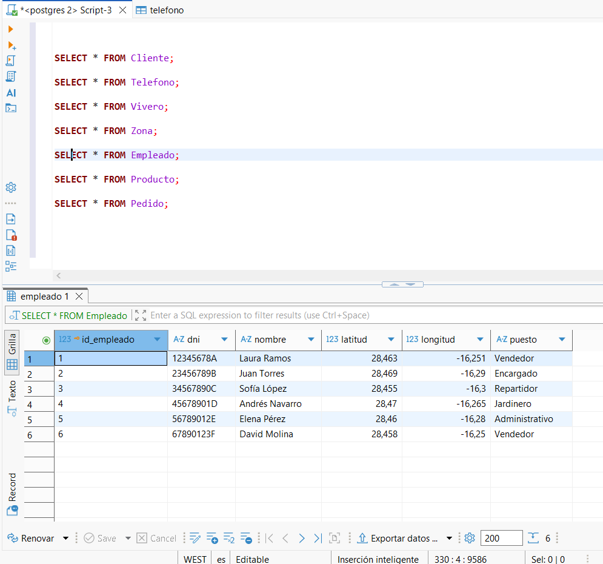
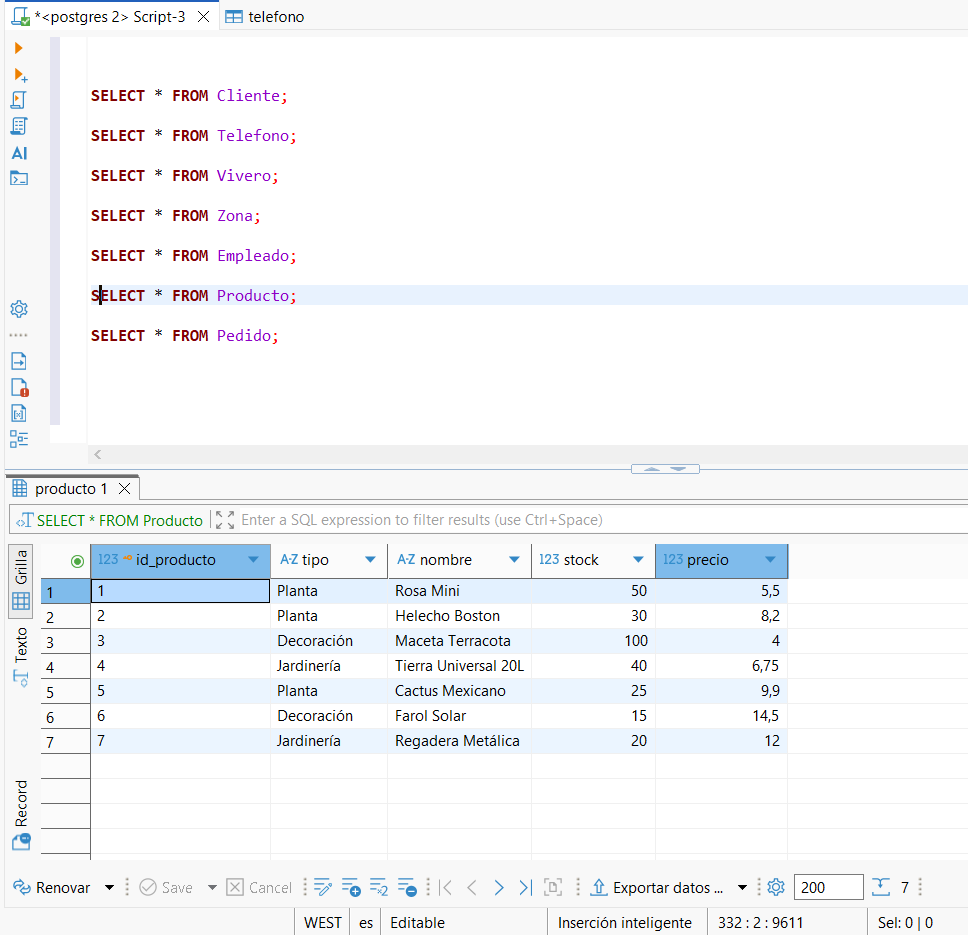
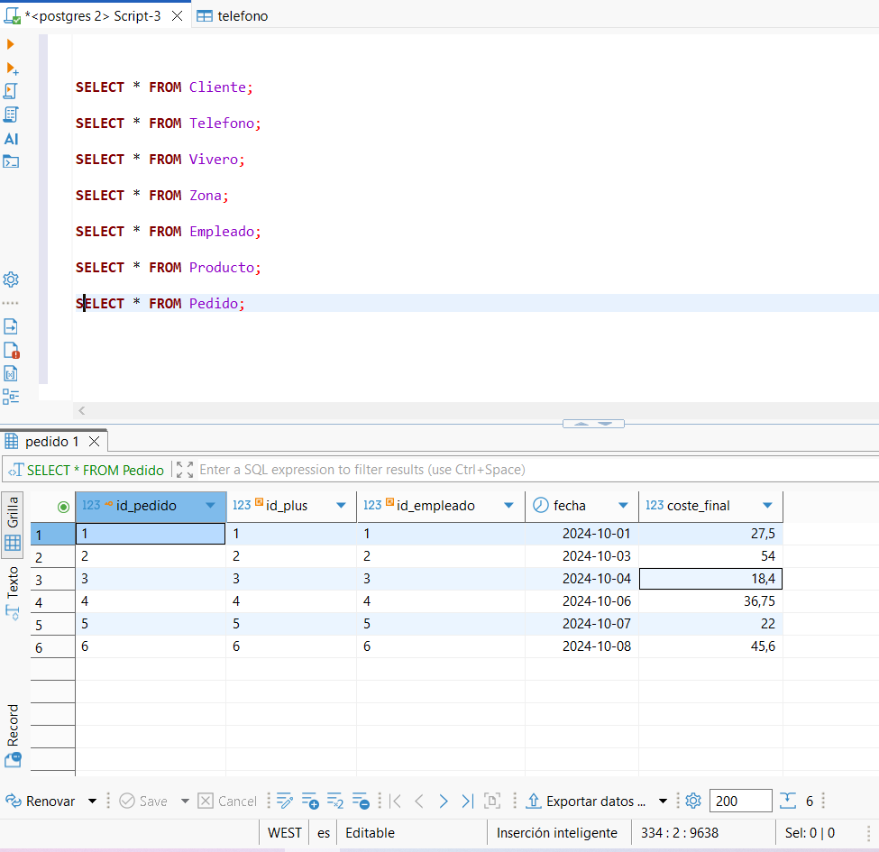

# prct04-AyD-BDD

##  Modelo Entidad/Relación

---

## diseño relacional

---

##  Diagramas individuales por entidad

###  Cliente

###  Teléfono

###  Vivero

###  Zona

###  Empleado

###  Producto

###  Pedido

---

##  Script SQL

El archivo `Script4.sql` contiene:
- Creación de la base de datos `viveros`
- Definición de todas las tablas con restricciones (`PK`, `FK`, `CHECK`, `NOT NULL`, etc.)
- Inserciones de ejemplo (5–7 registros por tabla)
- Consultas `SELECT * FROM ...` para verificar los datos

